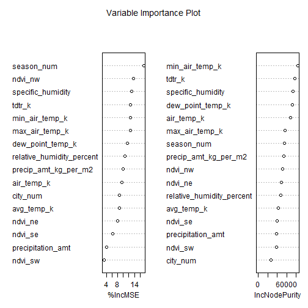
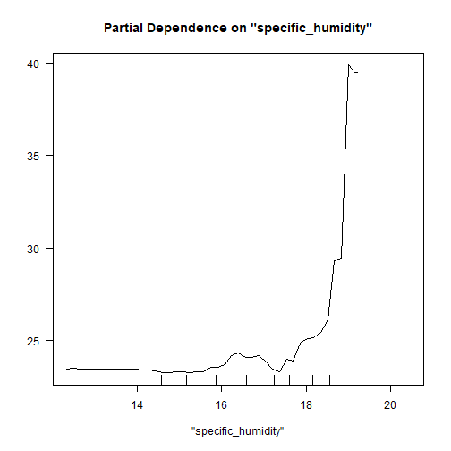
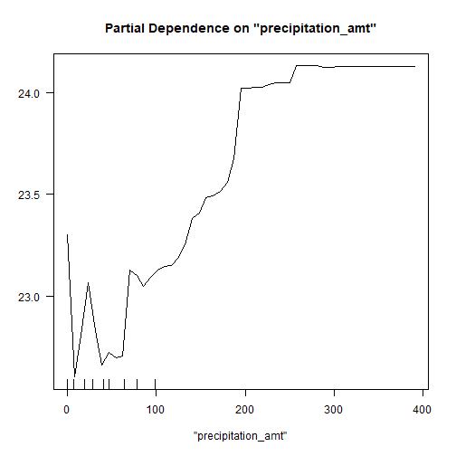
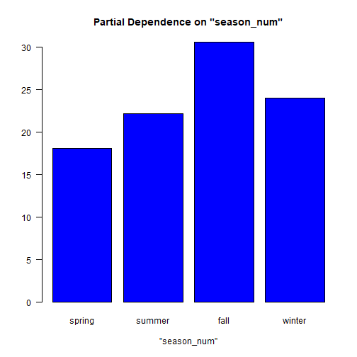
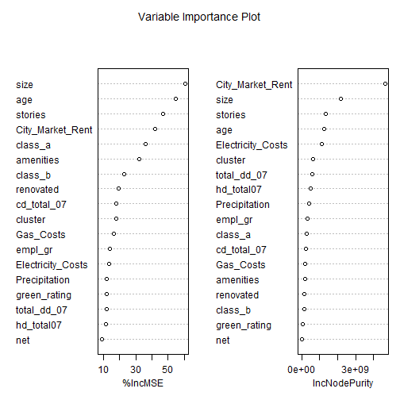
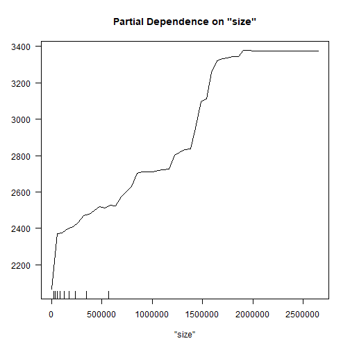
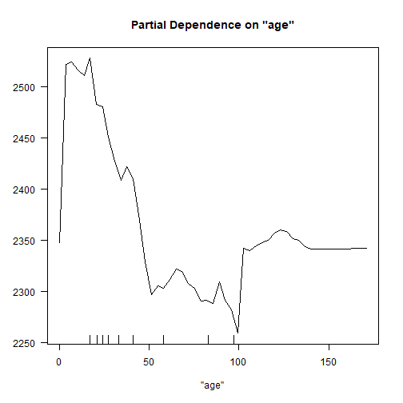
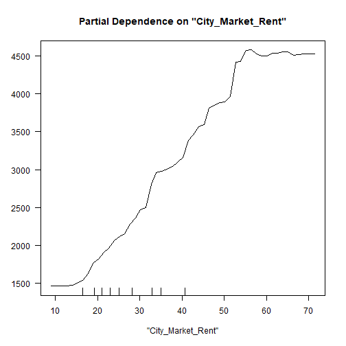
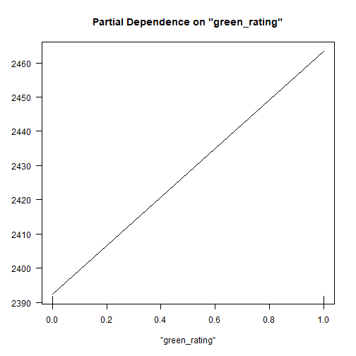

## 1. What Causes What?

1. The proposed approach of obtaining data from a few cities and regressing “Crime” on “Police” is almost certainly insufficient to establish any causal relationship. This is because likely exist many unobserved variables that confound the true connection between the number of police officers and crimes such as poverty, population density, or spending on public education. Consider for example the poverty rate in a given city. It is reasonable to assume that a high rate of poverty would engender high criminality. In response, the city would likely increase the number of police officers patrolling the street. Now, our regression of crime on police would yield a positive relationship between the number of cops and the crime rate. One could then erroneously conclude that a heightened police presence is causally responsible for the high crime rate.

2. The UPenn researchers approach involved using terrorism alert levels as an instrument for the amount of police officers on the street in order to determine the true effect of law enforcement presence on the crime rate. It is important to note that the city studied was Washington D.C., which is rather unique among American cities in that it uses terrorism alert levels (since as the nation’s capital, it contains many critical sites such as the White House and Congress which are likely targets for potential terror attacks). Unsurprisingly, a higher alert level corresponds to an increased police presence, hence the instrument is relevant. Furthermore, terrorism alerts should not be linked to “conventional’ crime, a feature that is indicative of instrument exogeneity. Ergo, as alert levels are a relevant an exogenous instrument for police numbers, they can identify the causal effect of police presence on crime. Table 2 demonstrates that when the alert level is high, and a greater police presence is induced, the expected number of crimes falls by approximately 7 (this result is significant at the 5% level). Finally, column (2) includes for Metro usage which serves as a proxy for the number of people on the street. When this control is included, the expected number of crimes during high alert periods is roughly reduced by 6 (also significant at the 5% level).

3. The UPenn researchers had to control for Metro ridership since this variable is representative of general activity in the city. It is plausible that a high terror level would disincentivize people from leaving their homes, which would reduce foot traffic. With less people in the street, there are fewer potential victims (and perhaps perpetrators) meaning one would observe a decrease in crime on high alert days. Conversely, high terror alert levels could be implemented as a response to large public events such as parades or festivals which imply more foot traffic and potentially more crime. Irrespective of the sign of the effect, controlling for Metro ridership strengthens the argument that the alert level is unrelated to crime. The researchers thus measured Metro usage during various alert levels. It was observed that after controlling for ridership, a greater police presence still affected crime rates negatively. Interestingly, the researchers discovered that ridership was generally not affected by the terror alert level system.

4. The first column of Table 4 depicts the effect of a high alert status, interacted with various districts of the city, on crime rates. Broadly speaking, this provides a more detailed look at the causal relationship between police presence and crime rates. From column 1 we see that an additional police officer in District 1 corresponds to a decrease in the expected number of crimes by roughly 2.6 (a result that is statistically significant at the 1% level). All other districts did not exhibit a statistically significant drop in crime levels. We note, however, that there was a statistically significant rise in crime when midday ridership increased. A possible conclusion that can be gleaned from this table is that when a high alert is announced, law enforcement presence increases primarily in District 1. Alternatively, if the number of police rises uniformly across the districts during a high alert, there may be another factor responsible for the observed drop in crime in District 1.


## 2. Tree Modeling: Dengue Cases

For this question, I decided to use number of dengue cases (rather than the log) as it seemed to predict with similar accuracy the plots/RMSE's that the model generated. Furthermore, the total number of cases seemed to be more informative and easier to interpret than its log equivalent.


Then I compared RMSE's for 5 regression models: Two tree models (one with all covariates and one with some amount of feature engineering), two random forest models similarly defined, and the optimal boosted tree model. The RMSE for the random forest model with all covariates performed best across multiple train-test splits with the lowest RMSE.


```r
varImpPlot(dengue_forest_all , main="Variable Importance Plot")
```



Along with `specific_humidity` and `precipitation_amt`, I chose to include a partial dependence plot for the `season` variable as the "wildcard" feature. This choice was informed by the variable importance plot above derived from the aforementioned best-performing random forest model. Here we see that `season` appears to have one of the strongest effects on dengue cases. We now examine the partial dependence plots for the variables.


```r
partialPlot(dengue_forest_all, 
                          dengue_test, 
                          'specific_humidity', 
                          las=1)
```



```r
partialPlot(dengue_forest_all, 
                       dengue_test, 
                       'precipitation_amt', 
                       las=1)
```



```r
partialPlot(dengue_forest_all, 
                         dengue_test, 
                         'season_num', 
                         las=1)
```


We note several findings:

Dengue cases appear to rise almost exponentially at a specific humidity greater than 18g H~2~O/kg of air. Interestingly, dengue cases seem to first decrease with precipitation then rise again with higher rainfall. In general, this is a reasonable result as mosquitoes require rainfall to breed. A possible explanation for the initial drop in cases at low to medium levels of precipitation may be explained by the fact that mosquitoes actually rely on *standing water* to reproduce. Ergo, low/moderate rainfall may only serve to disturb existing mosquito breeding sites via overflowing, whereas high rainfall has the potential to create new breeding sites through flooding to offset the aforementioned disruption. Of course, testing this hypothesis would require further studies that take into account geographical and hydrological factors. Finally, the `season` variable informs us that dengue cases tend to increase with temperature, peaking in the summer/fall months. Indeed, there is a marked increase in dengue cases at around 70 degrees F, (which corresponds to 297 degrees K, as Kelvins are the unit of temperature used in the data set). Multiple online sources I accessed confirm that temperatures between 70 and 80 F are most favorable to mosquito activity.


## 3. Green Certification

For this model, I decided to collapse LEED and EnergyStar into a single "green certified" category as I believed this would offer a more global perspective on green certifications. To this end, I decided to use the variable `green_rating` which is an indicator for whether the building is either LEED- or EnergyStar-certified.

The first step involved removing any "superfluous" variables. LEED and EnergyStar were immediately omitted since as aforementioned, I had decided to join the two into a single category. Rent and leasing_rate were also removed to avoid collinearity as our outcome variable i.e. revenue/sqft/year is a linear combination of these two.


```r
green_rmsetable
```

<table>
<caption>Out-of-Sample Model Performance</caption>
 <thead>
  <tr>
   <th style="text-align:left;"> Model </th>
   <th style="text-align:left;"> RMSE </th>
  </tr>
 </thead>
<tbody>
  <tr>
   <td style="text-align:left;"> Lasso </td>
   <td style="text-align:left;"> 1593.0852388943 </td>
  </tr>
  <tr>
   <td style="text-align:left;"> Boosted </td>
   <td style="text-align:left;"> 879.022833472687 </td>
  </tr>
  <tr>
   <td style="text-align:left;"> Random Forest </td>
   <td style="text-align:left;"> 672.525059500673 </td>
  </tr>
</tbody>
</table>
I then compared performance across three models: lasso, boosted tree, and random forest. As evidenced by the table above, the random forest model yielded the lowest RMSE and was thus selected.

**Analysis:**

First, we analyze the variable importance plot derived from the aforementioned random forest model:


```r
varimpforest <- varImpPlot(green_forest, main="Variable Importance Plot")
```



Some of the strongest effects on our outcome variable were engendered by the variables: `size`, `age`, and `City_Market_Rent`, for which I provide partial dependence plots below.


```r
partialPlot(green_forest, green_test, 'size', las=1)
```


Our outcome variable i.e. rent/sqft (per calendar year) naturally depends on the size (total square footage of the building). From the `size` partial dependence plot we see that the rent/sqft rises with greater total floor area an plateaus around 2 million sqft. We note that `size` has the second highest %IncMSE and node purity, indicating its high explanatory power.


```r
partialPlot(green_forest, green_test, 'age', las=1)
```


The `age` partial dependence plot displays an interesting relationship wherein the rent/sqft rapidly rises then gradually falls to a "trough" before spiking again (albeit to a lesser extent) at a building ages greater than 100 years. The initial increase represents the natural depreciation of a building's value and thus rent over time until it reaches its salvage value (to use accounting terminology). The secondary spike is most likely caused by the premium that many buyers will place on old buildings given their history or perhaps unique architectural style. This demand will thus lead to a higher rent for such buildings. Like, `size`, `age` ranks highly on %IncMSE (in fact, it tops this category) and node purity, indicating its explanatory power


```r
partialPlot(green_forest, green_test, 'City_Market_Rent', las=1)
```


I also thought it would be worthwhile to examine a partial dependence plot of `City_Market_Rent` as this variable held the highest node purity. This is unsurprising as the variable is defined as "a measure of average rent per square-foot per calendar year in the building's local market". Thus, `City_Market_Rent` essentially pools our oucome variable, rent/sqft/year in the area around the building. The market value of a building tends to be dictated to a large extent by the overall real estate prices in its area. Hence, buildings in close proximity to one another will likely have similar rent and leasing rates. This phenomenon is reflected in the partial dependence plot above where we observe a positive relationship between local average rent and a given building's rent.

Finally, we turn our attention to to `green_rating` as at the outset of this question I decided that I would utilize this variable as opposed to LEED or EnergyStar as an indicator of green certification. Thus, the partial dependence plot of `green_rating` is included below:


```r
partialPlot(green_forest, green_test, 'green_rating', las=1)
```


As `green_rating` is a binary indicator variable, we can deduce from the plot that that, on average, there is a roughly $70 difference between having a green certification or not. This implies that having a green certification is not a very significant factor in the rent/sqft/year associated with a building. This point is corroborated by `green_rating`'s low %IncMSE and low node purity.


